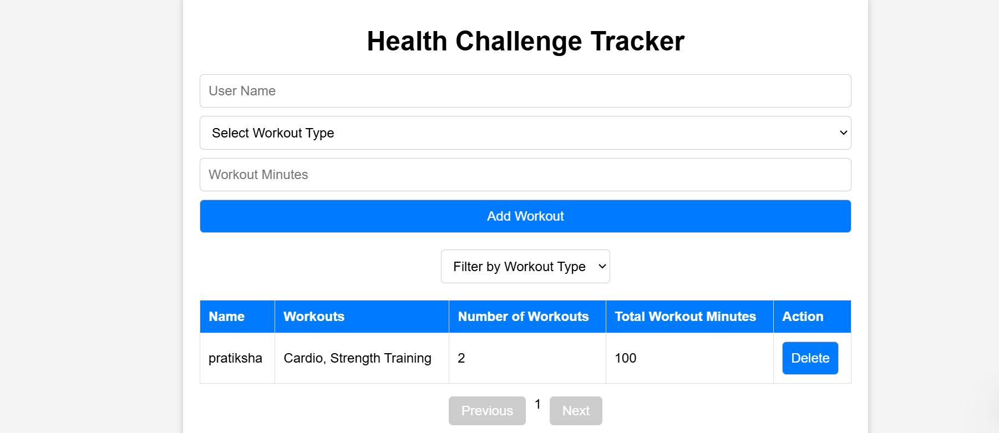

# 🏋️‍♂️ Health Challenge Tracker


## 📌 Overview

Health Challenge Tracker is a simple React-based application that allows users to log their workouts, filter them based on type, and track workout minutes. It also supports pagination and stores data in **localStorage** to persist across page refreshes.

## 🚀 Features

- Add workouts with **user name, workout type, and duration (in minutes)**.
- Display all workouts in a **table format**.
- **Filter workouts** by type.
- **Search** for workouts by user name.
- **Paginate** through the list of workouts.
- Aggregate workouts by **user** (entries with the same name are merged).
- Store workouts in **localStorage** to persist data.

## 🛠️ Tech Stack

- React.js ⚛️
- JavaScript (ES6+)
- HTML & CSS


## 🔧 Installation

#### Instructions to Run the App Locally

### Prerequisites
- [Node.js](https://nodejs.org/) (version 14 or higher)
- [npm](https://www.npmjs.com/) or [yarn](https://yarnpkg.com/)

### Steps
1. **Clone the Repository**
   ```bash
   git clone https://github.com/your-username/health-challenge-tracker.git
   cd health-challenge-tracker
   ```

2. **Install Dependencies**
   ```bash
   npm install
   ```

3. **Run the Application**
   ```bash
   npm start
   ```

4. **Access the Application**
   Open your browser and navigate to:
   ```
   http://localhost:3000
   ```


